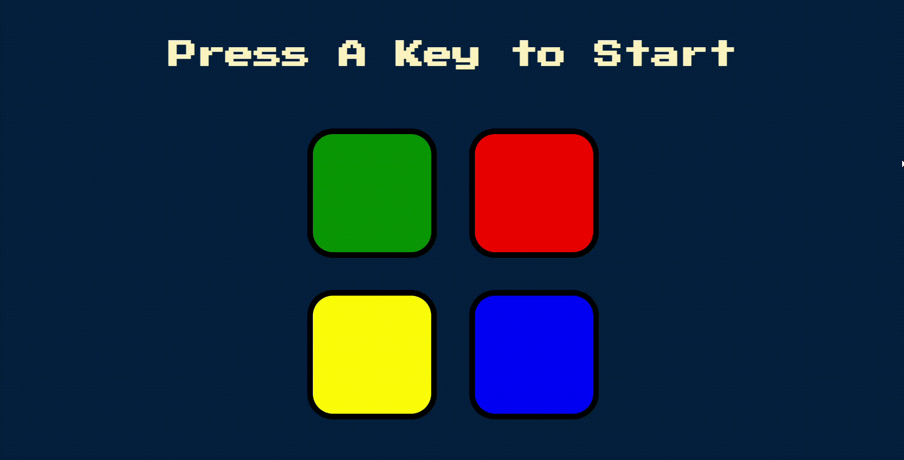

# Simon Game

This is a web-based recreation of the classic Simon memory game. Test your memory by repeating the sequence of colors and sounds as it grows longer with each successful round.

## Live Demo

Play the game online: [https://anurag2118.github.io/Simon-Game/](https://anurag2118.github.io/Simon-Game/)
## Gameplay Demo

See how to play and challenge your memory:


## How to Play

1.  **Start the Game:** Press any key on your keyboard to begin.
2.  **Watch the Sequence:** The game will flash a color and play a sound.
3.  **Repeat the Sequence:** Click the corresponding colored button(s) in the exact order shown.
4.  **Advance Levels:** If you match the sequence correctly, the game will add another color to the pattern, increasing the difficulty.
5.  **Game Over:** If you click the wrong color, the game ends. You can press any key to restart and try again!

## Features

* **Classic Gameplay:** A faithful recreation of the addictive Simon memory challenge.
* **Progressive Difficulty:** Levels increase as you successfully recall patterns.
* **Visual & Audio Cues:** Each button press and sequence step provides distinct light and sound feedback.
* **Game Over State:** Clear indication when a mistake is made, with an easy restart option.

## Technologies Used

* HTML5
* CSS3
* JavaScript
* jQuery

## Getting Started

To get a local copy of this game up and running:

1.  **Clone the repository:**
    ```bash
    git clone [Your GitHub Repository URL]
    ```
    2.  **Navigate to the project directory:**
    ```bash
    cd Simon-Game
    ```
3.  **Open `index.html`** in your web browser.

## Project Link

[https://github.com/Anurag2118/Simon-Game]
